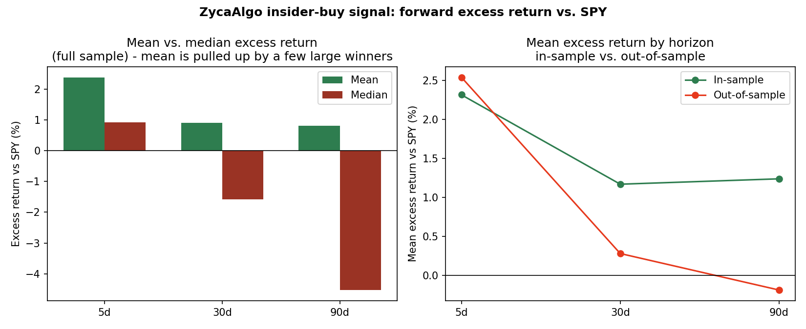

# Does insider open-market buying predict returns? A backtest of the ZycaAlgo signal

**Author:** Nattawut Chaichanawanich
**Date:** 2026-08-07

## Abstract

ZycaAlgo is a system that scans every SEC Form 4 filed by public-company officers and directors and flags genuine open-market purchases (transaction code P) worth at least $100,000, excluding trades made under pre-arranged Rule 10b5-1 plans. This is the same signal definition studied in the insider-trading literature going back to Seyhun (1986) and Lakonishok & Lee (2001): the hypothesis is that officers and directors have private information about their own company, and that when they choose to buy stock with their own money — outside of a scheduled plan — it carries real informational content.

This report backtests that specific signal definition against SEC's official bulk Form 3/4/5 dataset, covering 2023 Q3 through 2025 Q2. It finds a statistically significant positive excess return over the following week (+2.38% mean vs. SPY, p < 0.0001, holding up out-of-sample), but a **significant reversal** by the 90-day horizon that a naive mean-based test misses entirely.

## 1. Data and methodology

**Signal universe.** SEC publishes a bulk, pre-parsed quarterly dataset of every Form 3/4/5 filing (`sec.gov/data-research/sec-markets-data/insider-transactions-data-sets`), broken into structured tables (submissions, reporting owners, non-derivative transactions). This is the same underlying data ZycaAlgo's daily scanner reads from individual filing XML — the bulk dataset just lets a multi-year backtest run in minutes instead of scraping thousands of filings one at a time.

For each quarter from 2023q3 to 2025q2, a transaction qualifies as a signal if:
- Filed on a Form 4 (not 3 or 5),
- Transaction code `P` (open-market purchase),
- The reporting owner is flagged `Director` and/or `Officer`,
- Not flagged under a Rule 10b5-1 plan (`AFF10B5ONE`),
- Total dollar value (shares x price) >= $100,000.

**Collapsing to one signal per event.** A single real-world buy is frequently reported as multiple line items — split across several lots, or filed by multiple insiders on the same day. Treating each line item as an independent observation would pseudo-replicate one event and artificially inflate the sample size feeding the significance tests below. All qualifying line items for the same ticker on the same filing date are collapsed into one signal, with dollar values summed (this also naturally captures cluster buying — multiple insiders buying the same stock the same day — as a single higher-conviction event rather than double-counting it).

This produced 4,014 signal events after collapsing (from 6,103 raw filing line items) and cleaning out 97 non-standard ticker symbols (SPAC units, exchange-prefixed tickers, preferred-share notation that isn't tradable price data). 1,682 unique tickers were involved.

**Entry point.** The entry date is the first trading day on or after the **filing date**, not the transaction date. Form 4 must be filed within two business days of the trade, so by the time a real-time scanner reads the filing, the trade has usually already happened — using the filing date (when the signal actually becomes actionable) rather than the transaction date avoids a look-ahead bias that would otherwise overstate the strategy's real-world edge.

**Price data.** Daily bars from Alpaca Markets, split-adjusted (not dividend-adjusted — see Limitations). 1,494 of 1,682 tickers had usable price history; 3,561 of 4,014 signals had both entry and exit prices available at every horizon tested.

**Benchmark.** SPY, over the identical entry/exit dates as each individual signal (not a fixed calendar period), so excess return isolates the signal's performance from the market's overall drift during that specific window.

**Horizons.** Forward returns computed 5, 30, and 90 *trading* days after entry.

**In-sample / out-of-sample split.** The most recent 30% of signals by filing date (from 2024-12-18 onward) were held out and never used while building or tuning the filter definition above — that definition is unchanged from ZycaAlgo's live production scanner. Reporting results separately for this held-out period is the key test of whether the effect is real or curve-fit.

**Significance tests.** Both a paired t-test (tests the mean) and a Wilcoxon signed-rank test (tests the median, and does not assume the returns are symmetrically distributed) are reported for each horizon and period. As Section 3 shows, these two tests disagree at the longer horizons, and that disagreement is itself the most informative result in this report.

## 2. Results

| Horizon | Period | n | Mean excess ret | Median excess ret | Hit rate | t-stat | t-test p | Wilcoxon p |
|---|---|---|---|---|---|---|---|---|
| 5d | Full sample | 3,550 | +2.38% | +0.92% | 57.1% | 14.05 | <0.0001 | <0.0001 |
| 5d | In-sample | 2,465 | +2.31% | +0.89% | 56.3% | 11.21 | <0.0001 | <0.0001 |
| 5d | Out-of-sample | 1,085 | +2.54% | +0.98% | 58.8% | 8.57 | <0.0001 | <0.0001 |
| 30d | Full sample | 3,542 | +0.90% | -1.58% | 44.6% | 2.46 | 0.0140 | 0.0002 |
| 30d | In-sample | 2,457 | +1.17% | -1.30% | 45.3% | 2.83 | 0.0047 | 0.0638 |
| 30d | Out-of-sample | 1,085 | +0.28% | -2.17% | 42.8% | 0.38 | 0.7033 | 0.0001 |
| 90d | Full sample | 3,518 | +0.80% | -4.53% | 40.8% | 1.06 | 0.2877 | <0.0001 |
| 90d | In-sample | 2,441 | +1.24% | -3.37% | 43.3% | 1.30 | 0.1948 | <0.0001 |
| 90d | Out-of-sample | 1,077 | -0.19% | -6.33% | 35.1% | -0.16 | 0.8748 | <0.0001 |

## 3. Discussion

**The 5-day result is the strongest finding, and it replicates out-of-sample.** Both tests agree: stock prices drift up roughly 2.4% more than SPY over the week following a qualifying insider buy filing, and this held (in fact was slightly stronger) in the 1,085 signals never touched while defining the filter. A 57–59% hit rate and t-stat above 8 in the held-out period is a genuinely hard result to explain away as noise or curve-fitting.

**At 30 and 90 days, the t-test and the Wilcoxon test tell opposite stories — and the disagreement is the finding.** The t-test's p-values climb toward insignificance (0.70 and 0.87 out-of-sample), which reads as "the edge fades out and disappears." But the Wilcoxon test stays highly significant (p < 0.0001) at every period and horizon past 5 days. Since the *median* excess return at those horizons is clearly negative (as low as -6.33% at 90 days out-of-sample) and the hit rate drops to 35–45%, that significance is in the **negative** direction: the typical stock in the signal set is significantly *underperforming* SPY by 90 days, not merely failing to keep up.

The reconciliation is skew. A small number of large winners (the right tail) are large enough to pull the *mean* back up to a small positive number even while the *median* — a better description of what happens to a typical signal — is meaningfully negative. A test built on the mean (the t-test) is sensitive to that tail and reports "no significant effect." A test built on ranks (Wilcoxon) is not, and reports the true central tendency: most of these trades are behind the benchmark by 90 days.

**Practical reading:** the data supports acting on this signal as a short-horizon (roughly one-week) drift signal, consistent with the "genuine, non-scheduled buy = private information" hypothesis at short horizons. It does *not* support holding a position built on this signal for a quarter and expecting to beat the market — by that point the evidence points toward mild underperformance for the median position, even though a few big winners would make an average-return summary look fine.

## 4. Limitations

- **No liquidity or market-cap filter applied in this backtest**, unlike ZycaAlgo's live paper-trading system (which additionally requires $1B+ market cap, 500K+ average daily volume, and S&P 500/NASDAQ listing). This backtest is testing the raw signal definition against the broadest possible universe; the live system's additional filters exist for practical tradability reasons (slippage, ability to actually execute the position size), not because they were shown here to improve the signal — that would be a natural extension of this analysis.
- **Price-return only, not total return.** Bars are split-adjusted but not dividend-adjusted, so neither the signal legs nor the SPY benchmark include dividends. This should mostly cancel out in the excess-return calculation (both sides miss dividends over the same window) but is not exactly neutral, since dividend yields differ between individual stocks and the index.
- **No transaction costs, slippage, or market-impact modeled.** Real execution would erode some of the 5-day edge, particularly for less liquid names.
- **Survivorship in ticker matching.** 188 of 1,682 tickers had no usable Alpaca price history (delistings, ticker changes, thinly-traded names) and were dropped rather than imputed. If delisted/failed companies are disproportionately represented among ignored tickers, this could bias results in either direction.
- **A single, particular 21-month window.** 2023q3-2025q2 was not an unusually turbulent period for U.S. equities overall; results have not been tested against a recession or high-volatility regime.

## 5. Conclusion

The specific signal ZycaAlgo trades on — genuine, non-10b5-1, officer/director open-market purchases over $100K — shows a real, statistically significant, out-of-sample-replicated positive drift over the following week. That effect does not persist to a 90-day horizon; if anything, the median outcome reverses to a significant underperformance over that longer window, a pattern only visible because a distribution-free test was used alongside the standard t-test. This is consistent with treating the signal as a short-horizon indicator of new information reaching the market, not as a long-term stock-picking heuristic.

---
*Methodology and code: `scripts/backtest_insider_signals.py` and `scripts/plot_backtest_results.py` in the ZycaAlgo repository. Raw signal data: `signals_raw.csv`, `signals_with_returns.csv`. Data sources: SEC EDGAR bulk insider-transactions dataset (data), Alpaca Markets (historical price bars).*
